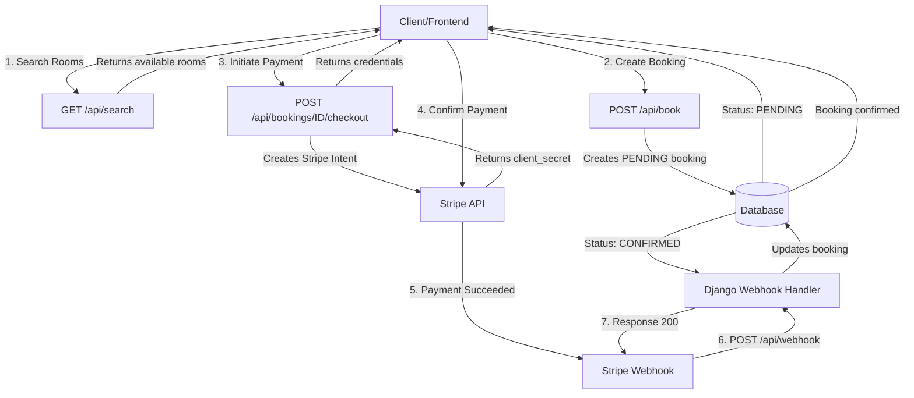

# 🏨 Hotel Booking Engine API

       [](https://hub.docker.com/repository/docker/mohammed237/booking-engine)

A robust, production-ready REST API for a hotel booking system. Features dynamic pricing, real-time inventory management, automated expiration of unpaid bookings ("Zombie Killer"), and secure payments via Stripe. Built with **Django REST Framework**, **Celery**, **Redis**, and **Stripe**.

## 📋 Table of Contents

- [Features](#-features)
- [API Flow Diagrams](#-api-flow-diagrams)
- [Quick Start (Docker)](#-quick-start-docker---easiest-method)
- [Manual Development Setup](#-manual-development-setup)
- [Configuration Reference](#-configuration-reference)
- [Testing Guide](#-testing-guide)
- [API Documentation](#-api-documentation)
- [Project Structure](#-project-structure)

---

## ✨ Features

### 📅 Booking & Inventory

- **Real-time Availability**: Prevents double-booking using atomic database transactions.
- **Dynamic Pricing Engine**: Calculates prices based on:
  - Date ranges (e.g., High Season)
  - Days of the week (e.g., Weekend rates)
  - Room types
- **The "Zombie Killer" Task**: A background job (Celery) that automatically expires "Pending" bookings if they remain unpaid for more than 15 minutes, releasing inventory back to the pool.

### 💳 Payments (Stripe)

- **Payment Intents**: Secure handling of payments using Stripe's modern API.
- **Webhooks**: Listens for Stripe events to automatically confirm bookings upon successful payment.
- **"God Mode" Testing**: A developer-only feature to instantly confirm payments via API without a frontend (for testing purposes).
- **Refund Handling**: Logic for calculating refunds and penalties based on cancellation policies (48-hour rule).

### 🛠 Technical

- **Authentication**: JWT (JSON Web Token) authentication.
- **Documentation**: Auto-generated Swagger/OpenAPI docs via drf-spectacular.
- **Dockerized**: Ready for containerized deployment.

---

## 🌊 API Flow Diagrams

### Complete Booking Workflow



---

## 🚀 Quick Start (Docker) - Easiest Method

Use this method to run the entire system (Django, Postgres, Redis, Celery) instantly without installing any dependencies on your machine.

**Prerequisites**: Only Docker Desktop and Git.

> **💡 Quick Download**: Want to skip cloning the repository? You can pull the pre-built Docker image directly from Docker Hub:
>
> ```bash
> docker pull mohammed237/booking-engine:v1
> ```
>
> **[View image on Docker Hub](https://hub.docker.com/repository/docker/mohammed237/booking-engine)** for updates, documentation, and version history.

### 1. Clone & Setup Environment

```bash
# Clone the repository
git https://github.com/Mohammed2372/Booking-Engine-API.git
cd Booking-Engine-API

# Copy the example env file to create your local config
cp .env.example .env
# (On Windows use: copy .env.example .env)

# Open the .env file and fill in your specific keys:
# - SECRET_KEY
# - STRIPE Keys (Public, Secret, Webhook)
```

### 2. Run the Application

Run this single command to download the image, set up the database, and start the servers.

```bash
docker compose -f docker-compose.prod.yml up
```

- **API**: http://localhost:8000/api/ # main entrypoint
- **Swagger Docs**: http://localhost:8000/api/docs/ # interactive API docs

### 3. Create Admin User (Optional)

To access the admin panel, create a superuser inside the running container:

```bash
docker compose -f docker-compose.prod.yml exec web python manage.py createsuperuser
```

---

## 💻 Manual Development Setup

Use this method only if you are a developer contributing to the code and want to run services individually for debugging.

### Prerequisites

- Python 3.10+
- PostgreSQL
- Redis (for Celery)
- Stripe CLI

### 1. Environment Setup

```bash
# Create virtual environment
python -m venv .venv
source .venv/bin/activate
# On Windows: .venv\Scripts\activate

# Install dependencies
pip install -r requirements.txt

# Create .env from example
cp .env.example .env
```

### 2. Install & Configure Services

You must install these manually if running outside Docker:

#### A. PostgreSQL

- Install PostgreSQL for your OS.
- Create a database named `booking_db`.
- Update `.env` to set `SQL_HOST=localhost`.

#### B. Redis

- Install Redis (`brew install redis` or download for Windows).
- Ensure it is running on port 6379.
- Update `.env` to set `CELERY_BROKER=redis://localhost:6379/0`.

#### C. Stripe CLI

- Install Stripe CLI to forward webhooks to localhost.
- Run `stripe login`.

### 3. Database Migrations

```bash
python manage.py migrate
python manage.py createsuperuser
```

### 4. Running Services (4 Terminal Windows Needed)

1. **Django Server**: `python manage.py runserver`
2. **Celery Worker**: `celery -A core worker -l info`
3. **Celery Beat**: `celery -A core beat -l info`
4. **Stripe Listener**: `stripe listen --forward-to localhost:8000/api/webhook/`

## 🔧 Configuration Reference

### Celery Configuration

Located in `core/celery.py`:

```python
# Task routing
CELERY_TASK_ROUTES = {
    'bookings.tasks.expire_pending_bookings': {'queue': 'default'},
}

# Task time limits (prevent hanging tasks)
CELERY_TASK_TIME_LIMIT = 30 * 60  # 30 minutes hard limit
CELERY_TASK_SOFT_TIME_LIMIT = 25 * 60  # 25 minutes soft limit

# Celery Beat schedule (in core/settings.py)
CELERY_BEAT_SCHEDULE = {
    'expire-pending-bookings': {
        'task': 'bookings.tasks.expire_pending_bookings',
        'schedule': crontab(minute='*/1'),  # Every minute
    },
}
```

### Stripe Configuration

Keys location: `core/settings.py`

```python
STRIPE_SECRET_KEY = os.getenv("STRIPE_SECRET_KEY")
STRIPE_PUBLIC_KEY = os.getenv("STRIPE_PUBLIC_KEY")
STRIPE_WEBHOOK_KEY = os.getenv("STRIPE_WEBHOOK_KEY")
```

Webhook endpoint: `POST /api/webhook/`

## 🧪 Testing Guide

### 1. The "Zombie Killer" Flow (Expired Bookings)

To test that bookings expire after 15 minutes:

1. **Create a Booking**: POST to `/api/book/`. Status will be `PENDING`.
2. **Wait**: Wait 16 minutes OR manually modify the `created_at` timestamp in DB.
3. **Check Status**: The Celery Beat task runs every minute. It should update status to `EXPIRED`.
4. **Verify Inventory**: You should be able to book the same room again immediately.

### 2. Stripe Payments (Backend Only / "God Mode")

We implemented a special testing flag to bypass the frontend card entry.

**Endpoint**: `POST /api/bookings/{id}/checkout/`

**Request Body**:

```json
{
  "auto_confirm": true
}
```

**Result**: The server contacts Stripe, forces a test charge using a Visa mock, and instantly updates the booking to `CONFIRMED`.

### 3. Stripe Webhooks (Real Simulation)

To test the real integration where Stripe notifies Django:

1. **Start Stripe Listener**:

   ```bash
   stripe listen --forward-to localhost:8000/api/webhook/
   ```

2. **Create a Booking** normally (get the `client_secret`).

3. **Confirm via CLI** (Simulates user paying on frontend):

   ```bash
   stripe payment_intents confirm pi_3Sk... --payment-method=pm_card_visa
   ```

4. **Verify**: Check your terminal. The webhook should hit `/api/webhook/` and you should see "✅ Booking confirmed via Webhook."

### 4. Running Unit Tests

```bash
# Run specific bookings app tests
python manage.py test bookings

```

---

## 📚 API Documentation

Once the server is running, visit:

- **Swagger UI**: http://localhost:8000/api/docs/ # for full interactive docs
- **ReDoc**: http://localhost:8000/api/schema/redoc/ # for alternative docs view
- **Admin Panel**: http://localhost:8000/admin/ # for managing models and admin dashboards

### Key Endpoints

| Method | Endpoint                       | Description            |
| ------ | ------------------------------ | ---------------------- |
| GET    | `/api/search/`                 | Search available rooms |
| POST   | `/api/book/`                   | Create a new booking   |
| GET    | `/api/bookings/{id}/`          | Get booking details    |
| POST   | `/api/bookings/{id}/checkout/` | Initiate payment       |
| POST   | `/api/bookings/{id}/cancel/`   | Cancel a booking       |
| POST   | `/api/webhook/`                | Stripe webhook handler |
| POST   | `/api/auth/login/`             | JWT authentication     |

---

## 📁 Project Structure

```
Booking Engine/                         # repository root
├── .env.example                        # example env variables
├── manage.py                           # Django management entrypoint
├── README.md                           # this file
├── requirements.txt                    # Python dependencies
│
├── authentication/                     # auth: registration & JWT
│   ├── admin.py                        # Django admin registrations
│   ├── models.py                       # auth-related models (users/profiles)
│   ├── serializers.py                  # DRF serializers for auth
│   ├── urls.py                         # endpoints: register/login/refresh
│   └── views.py                        # registration & auth views
│
├── bookings/                           # booking domain logic
│   ├── admin.py                        # admin for bookings/models
│   ├── models.py                       # Booking, Reservation, etc.
│   ├── serializers.py                  # DRF serializers for bookings
│   ├── services.py                     # business logic & helpers
│   ├── tasks.py                        # Celery tasks (e.g., expire bookings)
│   ├── tests.py                        # unit tests for bookings
│   ├── urls.py                         # booking-related endpoints
│   └── views.py                        # booking API views
│
├── core/                               # project core settings & entrypoints
│   ├── celery.py                       # Celery app configuration
│   ├── settings.py                     # Django settings
│   └── urls.py                         # root URL config (includes app urls)
│
├── inventory/                          # rooms, room types, availability
│   ├── admin.py                        # admin for RoomType model
│   ├── filters.py                      # DRF filters for search/listing
│   ├── models.py                       # Room, RoomType, PricingRule models
│   ├── serializers.py                  # DRF serializers for inventory
│   ├── services.py                     # inventory helpers & pricing engine
│   ├── urls.py                         # endpoints: room search
│   └── views.py                        # search & listing rooms API views
│
├── payments/                           # Stripe payment integration
│   ├── services.py                     # create payment intents, webhooks
│   ├── urls.py                         # endpoints: webhook
│   └── views.py                        # Stripe webhook handler
│
└── user/                               # user profile & wishlist & reviews
    ├── admin.py                        # user profile, wishlist and reviews dashboards
    ├── models.py                       # Profile, Wishlist models
    ├── serializers.py                  # DRF serializers for user
    ├── urls.py                         # endpoints: profile, wishlist, review
    └── views.py                        # user API views
```
